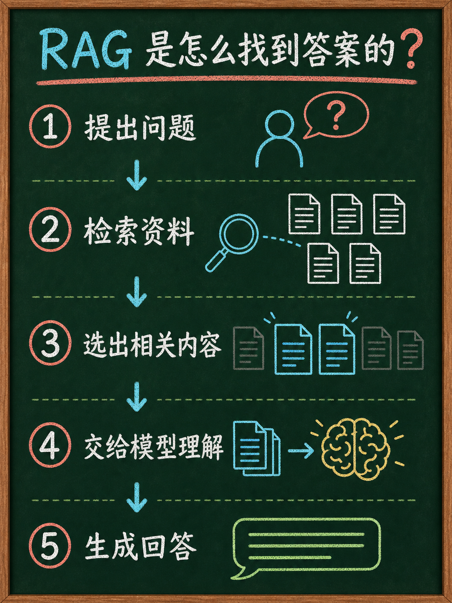
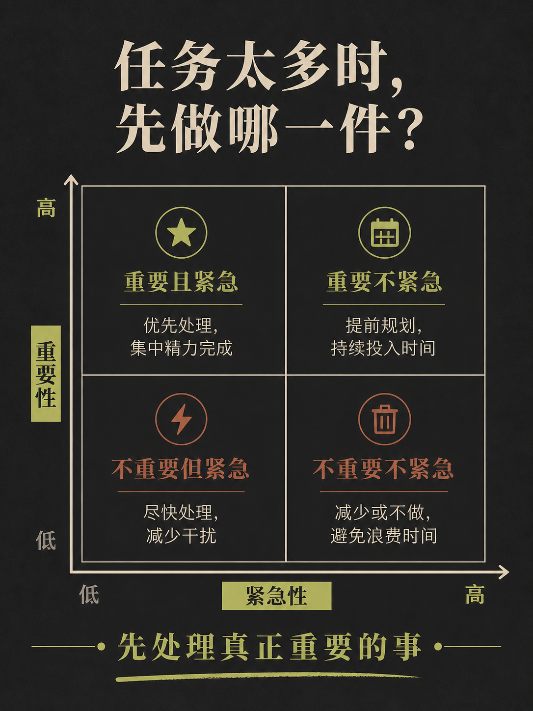
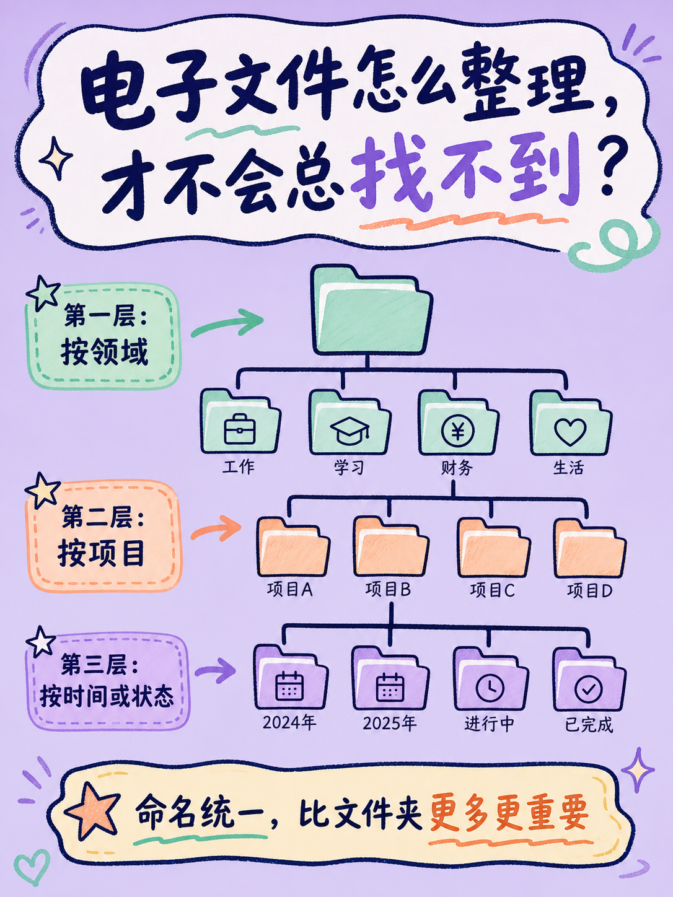

# ✨ 小红书 Creator OS

> 面向 Codex 的小红书内容工作流：从公开笔记调研、链接仿写、多对象对比，到知识卡配图，一次完成。

`Codex` · `Research` · `Rewrite` · `Compare` · `Image cards`

Creator OS 只读取公开内容，辅助研究和创作；不会自动发布、点赞、评论、关注或私信。

---

## 🎯 能做什么

| 你想做的事 | 直接这样说 | 输出内容 |
| --- | --- | --- |
| 方向调研 | `调研<地区> <主题> <对象>` | 正式样本、原始链接、作者、互动快照、详情状态与调研速览 |
| 读取并仿写笔记 | `仿写这个链接：<笔记链接>` | 原笔记信息、5 个标题、5 个钩子、可复制正文、5 个 CTA |
| 对比多个选择 | `对比<地区>的 <对象>` | 来源样本、百分制评分表、五星制发布正文、核验补充 |
| 拆解对标博主 | `抓这个博主收藏最高的 5 篇：<主页链接>` | 在本次扫描范围内按收藏快照排序的 Top N 笔记详情 |
| 做小红书配图 | `根据正文做 6 张知识卡` | 图片规划、封面确认、IP 资产路由与生图执行 |

---

## 🚀 快速开始

### 1. 下载后在 Codex 中打开本目录

```text
$xhs-creator-os
```

然后直接描述你的目标，不需要先学习脚本命令：

```text
调研<地区> <主题> <对象>

仿写这个链接：https://www.xiaohongshu.com/explore/...

对比<地区>的 <对象>

根据这篇正文做 6 张知识卡
```

### 2. 第一次抓取会发生什么？

1. Codex 检查本机 MediaCrawler 是否就绪；未安装时，会自动准备上游代码、Creator OS 适配补丁、Python 依赖与专用浏览器。
2. 未配置 Apify 时，公开数据任务默认使用本机 MediaCrawler。
3. 只有首次登录或登录态失效时，才会出现 MediaCrawler 原生二维码窗口；扫码验证成功后，Creator OS 自动继续原任务。

日常抓取使用隔离的专用浏览器 Profile，不接管你的日常 Chrome。国内小红书与海外 Rednote 的登录态分别保存，互不混用。

> macOS 如要求浏览器存储授权，请按系统提示完成授权；这用于保存专用浏览器的登录态，不会导出 Cookie。

---

## 🧭 工作流

```text
用户需求
  ├─ 调研 / 抓博主 ──► Research ──► 结构化样本 + 详情缓存
  ├─ 给笔记链接 ─────► Rewrite ───► 拆解 + 可复制仿写正文
  ├─ 对比多个对象 ───► Compare ───► 来源 + 评分 + 对比正文
  └─ 需要图片卡 ─────► Image ─────► 封面规划 + 生图 Skill
```

所有数据任务都会先检查兼容的本地缓存：

- 同一笔记详情不重复读取。
- 关键词、筛选条件和样本量完全一致时，复用已有调研结果。
- 相似但不完全一致的历史数据只能作为补充线索，不会被误当成本轮结果。

### 缓存生命周期

缓存不跑定时任务。每次用户发起搜索、详情读取或作者抓取时，Creator OS 会先检查缓存状态；若连续 14 天没有相关请求，则在下一次请求开始时，仅清理可重新抓取的详情缓存。历史运行记录、SQLite 数据与浏览器登录态不会被清理。

---

## 🔌 数据源

| 场景 | 默认路径 | 你需要做什么 |
| --- | --- | --- |
| 未配置 Apify | 本机 MediaCrawler | 首次数据任务时完成一次扫码登录 |
| 已配置 Apify | Apify → SocialDataX | 填入 API Key；默认 Actor 已内置 |
| 明确指定来源 | Media 或 Apify | Creator OS 按指定来源执行，不静默切换 |

### 可选：接入 Apify → SocialDataX

Apify 提供云端数据路径。只需在 [Apify Console](https://console.apify.com/) 创建 API Key；不需要在控制台手动选择 Actor。

```bash
cp .env.example .env.local
```

在 `.env.local` 中填写：

```bash
APIFY_API_TOKEN=你的_Apify_API_Key
```

默认 Actor：

```text
socialdatax~socialdatax-xhs-data-api
```

如需更换兼容 Actor：

```bash
APIFY_XHS_ACTOR=owner~actor-name
```

检查当前来源状态（不会显示密钥）：

```bash
python3 scripts/xhs_provider.py status
```

> Apify 的实际可用性受账户套餐、Actor 权限与余额影响。已配置 Apify 但请求失败时，Creator OS 会如实说明错误，不会把 Media 结果伪装成 Apify 结果。

---

## ⚙️ 可选配置：账号与视觉资产

调研和单篇仿写不要求先配置账号。需要长期让内容贴合某个账号时，再逐步补齐即可。

| 配置项 | 文件位置 | 用途 |
| --- | --- | --- |
| 账号定位 | `profile/account.yaml` | 身份、目标读者、内容支柱、语气和真实性边界 |
| Apify 密钥 | `.env.local` | 启用 Apify → SocialDataX，只保存在本机 |
| 动漫 IP 参考 | `assets/ip/refs/` + `manifest.yaml` | 图片卡片的风格锚点与表情资产 |
| 写实 IP 参考 | `assets/ip/real-dog/refs/` + `manifest.yaml` | 经确认的真实角色身份参考 |

### 配置账号定位

```bash
cp profile/account.example.yaml profile/account.yaml
```

填写账号身份、受众、内容支柱、语气和真实性边界。账号定位只会在笔记主题匹配，或你明确要求“按我的账号改写”时参与仿写；只说“仿写”时，默认保留原笔记主题。

### 配置图片 IP

将你拥有使用权的参考图放入对应文件夹，并更新 `manifest.yaml`。Creator OS 的 `xhs-image` 负责内容规划、IP 路由和质量检查；实际生图调用仓库内置的 Baoyu 图片模块。

---

## ✍️ 输出规则

### 调研

每条正式样本固定展示：标题原文链接、作者主页、发布日期、笔记类型、赞/藏/评/转快照与详情状态。

Media 路径会先抓候选卡片，再按当前意图筛选、读取选中正文，最后生成正式样本；搜索页卡片不会被直接当作正文证据。

### 仿写与正文

所有可发布正文统一包含：

- 5 个标题备选
- 5 个开头钩子
- 推荐组合
- 一个可一键复制的纯文本正文框
- 5 个 CTA 备选

标题不超过 20 字；标题、正文与标签合计不超过 1000 字。缓存命中与新抓取使用同一套输出结构。

### Compare

Compare 先展示来源样本与百分制评分分析，再输出可直接发布的五星制对比正文。费用、限制、冲突来源和待确认事项会放在正文外的“核验补充”，避免正文变成调研报告。

---

## 🎨 风格预览

内置图片卡支持以下 12 种通用视觉方向。生图时可以直接说“用 Notion 风格”或“用 Cute 风格”；个人 IP 和私有参考图不包含在这里。

<!-- STYLE_PREVIEWS_START -->
| Notion | Bold | Chalkboard |
| --- | --- | --- |
|  |  |  |


| Screen Print | Fresh | Study Notes |
| --- | --- | --- |
|  |  |  |


| Minimal | Warm | Sketch Notes |
| --- | --- | --- |
|  |  |  |


| Cute | Retro | Pop |
| --- | --- | --- |
|  |  |  |

<!-- STYLE_PREVIEWS_END -->

---

## 🗂️ 项目结构

Creator OS 是唯一的用户入口。`third_party/` 中的 MediaCrawler 与 Baoyu 是内部依赖：前者由安装脚本下载到被 Git 忽略的本地运行目录，后者随仓库附带并由 `xhs-image` 按需读取。

```text
xhs-creator-os/
├── README.md                         # 使用说明、配置与提问示例
├── SKILL.md                          # 总路由与统一输出协议
├── profile/
│   └── account.example.yaml           # 账号定位模板
├── assets/
│   ├── ip/                            # 可选 IP 参考资产
│   └── style-previews/                # README 的 12 张通用风格预览图
├── references/                        # 数据源、缓存、证据、文案与用户引导规则
├── skills/
│   ├── xhs-research/                  # 调研与作者主页采集
│   ├── xhs-rewrite/                   # 单篇笔记读取与仿写
│   ├── xhs-compare/                   # 多对象归类、评分与对比正文
│   └── xhs-image/                     # 图片规划、IP 路由与质量闸门
├── scripts/
│   ├── setup_mediacrawler.py          # 本机 Media 安装与检查
│   ├── media_session.py               # 隔离浏览器会话管理
│   ├── xhs_provider.py                # Apify / Media 数据源路由
│   ├── research_cache.py              # 缓存读取与生命周期管理
│   └── validate_copy.py               # 发布正文长度校验
├── tests/                             # 路由、缓存与数据规范测试
└── third_party/
    ├── mediacrawler/                  # 上游补丁、说明与本机运行目录
    │   └── runtime/                   # 自动下载；Git 忽略
    └── baoyu-xhs-images/              # 内置图片生成模块与参考知识
```

---

## 🔐 隐私、边界与许可证

- 只读取公开内容；不自动执行账号互动或发布。
- 互动数据是抓取时快照，不代表实时数据；缺失字段会显示“未知”。
- 不把公开笔记写成你的亲身经历，也不把未独立确认的政策、费用伪装成事实。
- 本机 MediaCrawler 仅用于遵守上游许可证与平台规则的个人学习、研究和低频测试；详见 [MediaCrawler 适配说明](third_party/mediacrawler/README.md)。
- 不要提交或分享 `.env.local`、`profile/account.yaml`、`data/`、`runs/`、浏览器 Profile、Cookie、二维码、订单或联系方式。
- `third_party/baoyu-xhs-images/` 保留其上游来源与许可证说明；使用前请一并阅读该目录内的 `LICENSE` 与 `UPSTREAM.md`。

---

## 🧪 开发与验证

检查本机 Media 环境：

```bash
python3 scripts/setup_mediacrawler.py --check
```

运行非 Apify 测试：

```bash
third_party/mediacrawler/runtime/.venv/bin/python -m pytest tests -q -k 'not apify'
```

提交前请确认不包含本地密钥、真实账号配置、缓存、运行结果或浏览器会话文件。
